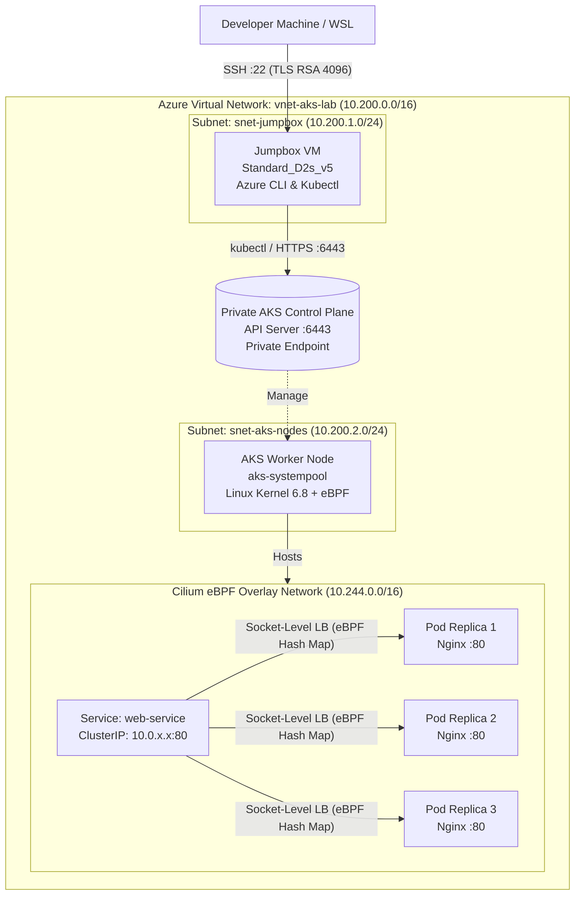

# 🚀 Private AKS with Azure CNI Powered by Cilium (eBPF)

[](https://www.terraform.io/)
[](https://azure.microsoft.com/)
[](https://kubernetes.io/)
[](https://cilium.io/)
[](LICENSE)

An enterprise-grade, reproducible sandbox lab demonstrating a **Private Azure Kubernetes Service (AKS)** cluster configured with **Azure CNI Powered by Cilium in Overlay mode**. 

This repository explores the elimination of `kube-proxy` in favor of Linux Kernel eBPF Socket-Level Load Balancing ($O(1)$ Hash Map lookups), private control plane isolation via Jumpbox architecture, self-healing pod lifecycles, and production-level troubleshooting.

---

## 🏗️ Architecture & Topology

The infrastructure isolates the Kubernetes Control Plane (API Server) inside a Virtual Network, blocking all direct inbound traffic from the public internet. Management and operations are conducted securely via an air-gapped Linux Jumpbox VM.



> **📌 Note on IP Addresses:**
> All IP addresses displayed in architectural diagrams and execution logs (e.g. `10.200.2.5` for the node, `10.244.0.x` for pods, and `10.0.63.110` for ClusterIP) are dynamic runtime examples captured during live benchmark verification. On every `terraform apply`, Azure and Kubernetes dynamically allocate fresh IP addresses within their designated subnet and overlay CIDR ranges.

---

## ⚡ Why Cilium eBPF over Traditional Kube-Proxy?

| Feature | Traditional `kube-proxy` + `iptables` | Azure CNI Powered by Cilium (eBPF) |
| :--- | :--- | :--- |
| **Routing Complexity** | $O(N)$ — Linear rule traversal. CPU usage and packet latency spike as services grow. | **$O(1)$** — Constant nanosecond lookups via Linux Kernel Hash Maps. |
| **Packet Interception** | Packets traverse the entire TCP/IP network stack. | **Socket-Level Translation:** Traffic redirected directly in kernel space during `connect()` syscall. |
| **IP Exhaustion** | Flat CNI consumes a VNet IP for every pod; subnet rapidly exhausts. | **Overlay Mode:** Only worker nodes consume VNet IPs; pods reside in an isolated overlay CIDR. |
| **Data Plane Engine** | Frequent context switching between User Space and Kernel Space. | Sandboxed, verified eBPF bytecode executing directly in Linux Kernel. |

---

## 🔬 Deep-Dive Live Verification & Proofs

### 1. Linux Kernel eBPF Load Balancing Hash Map
Inside the Cilium agent daemonset, inspecting the kernel BPF tables reveals that `web-service` (`10.0.63.110:80` in our verified run) points directly to the 3 pod endpoints without passing through iptables:

```bash
$ kubectl -n kube-system exec daemonset/cilium -c cilium-agent -- cilium-dbg bpf lb list

SERVICE ADDRESS          BACKEND ADDRESS (REVNAT_ID) (SLOT)
10.0.63.110:80/TCP (3)   10.244.0.115:80/TCP (5) (3)   # Slot 3 -> Pod 3
10.0.63.110:80/TCP (0)   0.0.0.0:0 (5) (0) [ClusterIP] # Master Virtual IP
10.0.63.110:80/TCP (2)   10.244.0.83:80/TCP (5) (2)    # Slot 2 -> Pod 2
10.0.63.110:80/TCP (1)   10.244.0.10:80/TCP (5) (1)    # Slot 1 -> Pod 1
```
*Note: Entries appear in hash-order rather than sequential order because they are stored in a kernel-level eBPF Hash Map.*

### 2. Pod Lifecycle & Self-Healing
- **Bare Pod vs. Deployment:** Deleting a standalone pod permanently terminates it. In contrast, pods managed by a Deployment/ReplicaSet continuously evaluate `Desired State vs. Current State` (Reconciliation Loop); deleting a pod causes the ReplicaSet to spawn a replacement within seconds.
- **Horizontal Scaling:** Scaling to 3 replicas instantly assigns unique overlay IPs (`10.244.0.x`) and registers 3 new endpoints in the Cilium datapath (`cilium-dbg endpoint list`).

### 3. Production Troubleshooting Post-Mortem
- **`ImagePullBackOff` Diagnosis:** Deploying a pod with a nonexistent image tag (`nginx:nonexistent999`) prevents container startup; root cause verified as a 404 Registry manifest error via `kubectl describe pod` under `Events`.
- **`CrashLoopBackOff` Diagnosis:** In an `exit 1` crashing scenario, the image pulls successfully but the application process terminates; root cause confirmed via Kubelet exponential backoff and `Last State: Terminated -> Exit Code: 1` inspection.

---

## 📦 Project Structure

```text
.
├── aks.tf              # Private AKS Cluster & Azure CNI Cilium Profile
├── jumpbox.tf          # Bastion VM, Dynamic TLS Key, NSG (Port 22), NIC
├── network.tf          # Resource Group, VNet (10.200.0.0/16), Subnets
├── outputs.tf          # Jumpbox Public IP, Cluster Name, Private FQDN
├── providers.tf        # HashiCorp azurerm (v5.x) & tls providers
└── variables.tf        # Configurable deployment parameters
```

---

## 🚀 Quickstart & Deployment

### 1. Prerequisites
- [Azure CLI](https://learn.microsoft.com/en-us/cli/azure/install-azure-cli) logged in (`az login`)
- [Terraform](https://www.terraform.io/) >= 1.0.0
- Active Azure Subscription

### 2. Deploy Infrastructure
```bash
git clone https://github.com/Elxeoo/aks-cilium-ebpf-lab.git
cd aks-cilium-ebpf-lab

terraform init
terraform plan
terraform apply -auto-approve
```

### 3. Connect via Jumpbox
```bash
# Extract dynamic SSH private key
terraform output -raw jumpbox_private_key > ~/.ssh/id_rsa_jumpbox
chmod 600 ~/.ssh/id_rsa_jumpbox

# SSH into Jumpbox
ssh -i ~/.ssh/id_rsa_jumpbox azureuser@<JUMPBOX_PUBLIC_IP>

# Verify Kubernetes & Cilium
kubectl get nodes -o wide
kubectl -n kube-system exec daemonset/cilium -c cilium-agent -- cilium-dbg status
```

### 4. Teardown (FinOps / $0.00 Cost)
```bash
terraform destroy -auto-approve
```

---

## 👤 Author
- **Can** ([@Elxeoo](https://github.com/Elxeoo))

---
## 📄 License
This project is licensed under the MIT License - see the [LICENSE](LICENSE) file for details.
